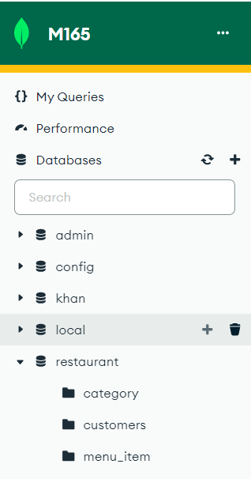

# KN02: Datenmodellierung für MongoDB

### A: Konzeptionelles Datenmodell (40%)

[Doku](./res/A-konzeptionelles_Datenmodell.drawio)


<b>Kurze textuelle Erklärungen zu den Entitäten und Beziehungen.</b>
Für mein Datenmodell habe ich entschieden ein einfaches Restaurant zu erstellen.

Dieses DM besteht aus 5 Entitäten:

- Die Menüartikel (`Menu_item`)
- Die Kategorie (`Category`)
- Die Bestellung (`Order`)
- Der Kund (`Customer`)

Die Beziehungen:

- `Category` -> `Menu_item`: Mehrere Kategorien können mehrere Artikel haben also handelt es sich um `many-to-many` Beziehung.
- `Order` -> `Menu_item`: Mehrere Bestellung können mehrere Menüartikel enthalten, also ist es ein `many-to-many` Beziehung.
- `Customer` -> `Order`: Ein Kund kann mehrere Bestellung haben, also ist es ein `many-to-one` Beziehung.

### B: Logisches Modell für MongoDB (50%)

[Doku](./res/B_Logisches_Modell.drawio)


<b>Erklärung zu Verschachtelungen. wieso haben Sie Ihre Variante gewählt.</b>

Ich habe diese Variante gewählt, da es Redundanz vermeidet.

- `Menu_item` hat eine Liste von `Category`.
- `Customer` -> `Order` und Bestellung ist verbunden mit `Menu_item`: Ein Kund kannn mehrere Bestellung haben und eine Bestellung kann mehrere Menüartikel enthalten.

### C: Anwendung des Schemas in MongoDB (10%)

```
use restaurant

db.createCollection("customers")
db.createCollection("category")
db.createCollection("menu_item")

```


