# KN05: Administration von MongoDB

### A: Rechte und Rollen (40%)

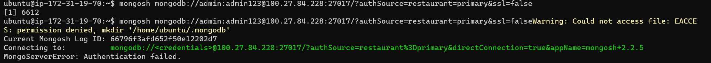

`db.system.users.find();`

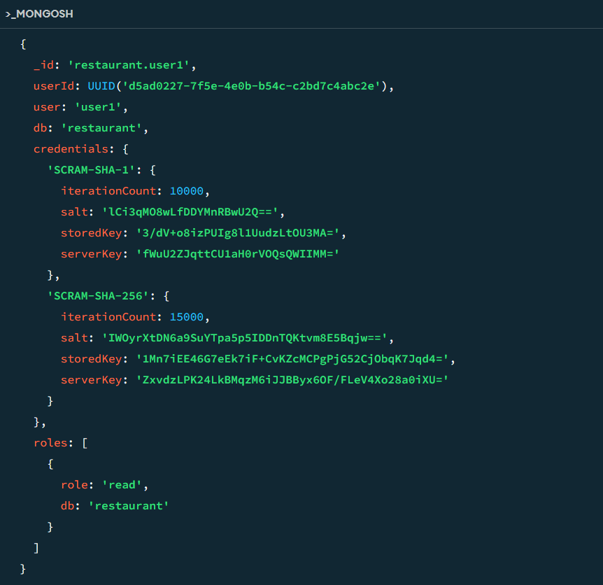

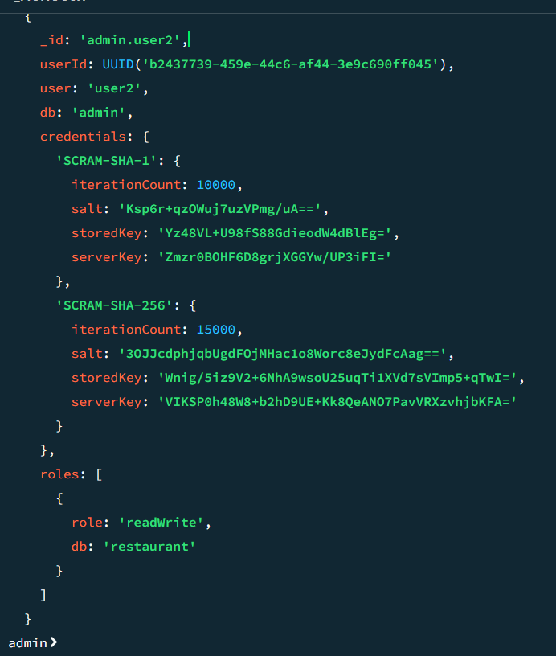

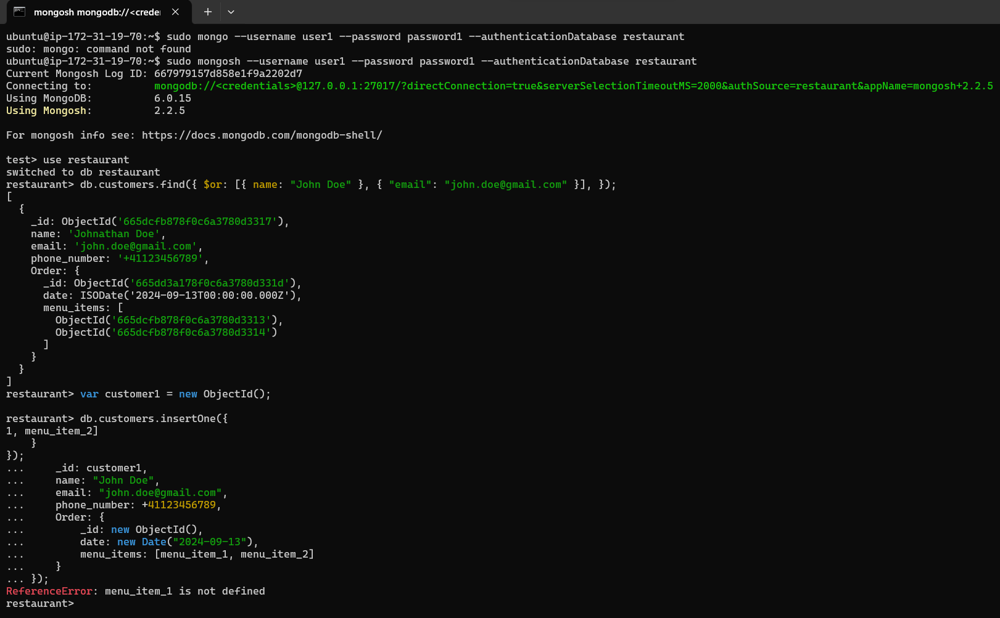

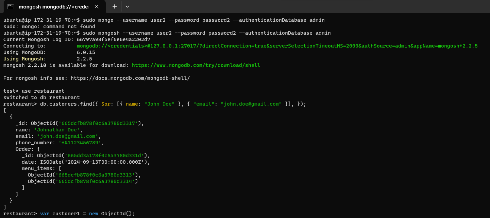

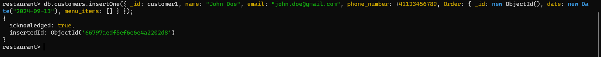

### B: Backup und Restore (40%)

<b>Variante 1:</b>

<b>Variante 2:</b>

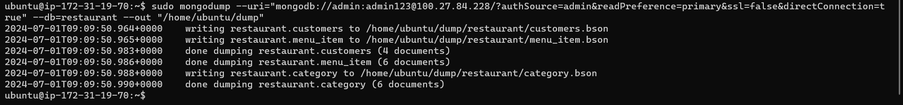

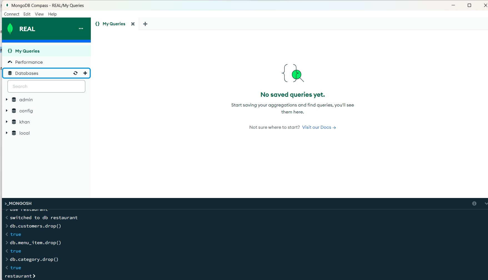

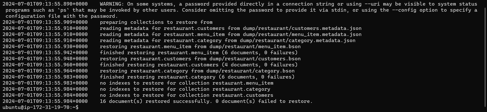

`sudo mongodump --uri="mongodb://admin:ps@100.27.84.228/?authSource=admin&readPreference=primary&ssl=false&directConnection=true" --db=restaurant --out "/home/ubuntu/dump"`

`sudo mongorestore --uri="mongodb://admin:ps@100.27.84.228/?authSource=admin&readPreference=primary&ssl=false&directConnection=true" "./dump"`

### C: Skalierung (20%)

<b>Unterschied zwischen Replication and Partition (Shards)</b>

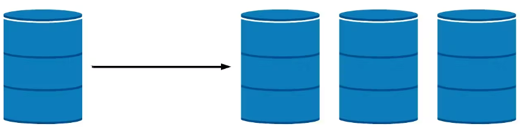

Replication in Datenbanken bedeutet, dass Daten kopiert und über mehrere Server (Replikate) verteilt werden. Es erhöht die Verfügbarkeit und Fehlertoleranz, indem Daten auf mehreren Servern kopiert werden.

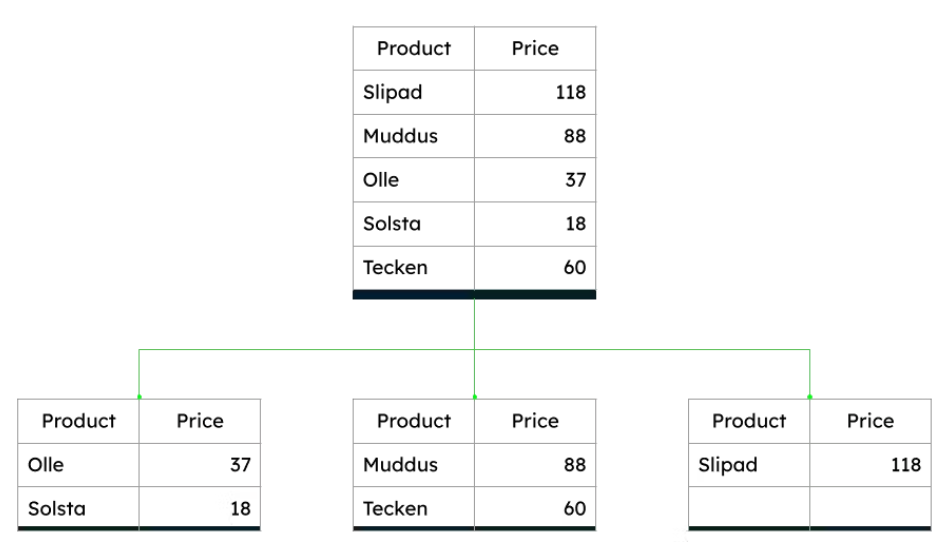

Sharding bedeutet, dass Daten horizontal in kleinere, besser handhabbare Teile (Shards) aufgeteilt werden. Es erhöht die Skalierbarkeit, indem Daten horizontal partitioniert und auf mehrere Server verteilt werden.

<b>Empfehlung an einer Firma</b>
Zum Beispiel bei Gmail. Die Applikation wächst schnell und hat bereits Millionen von Benutzern, die täglich viele E-Mails senden und empfangen.

- Bei Replication

* Erhöhte Fehlertoleranz
* Höhere Verfügbarkeit

- Partition (Shards)
  Horizontale Skalierbarkeit
  Verteilte Last

Durch die Implementierung von Replikation und Sharding können wir sicherstellen, dass die E-Mail-Anwendung hochverfügbar, skalierbar und leistungsfähig bleibt.
