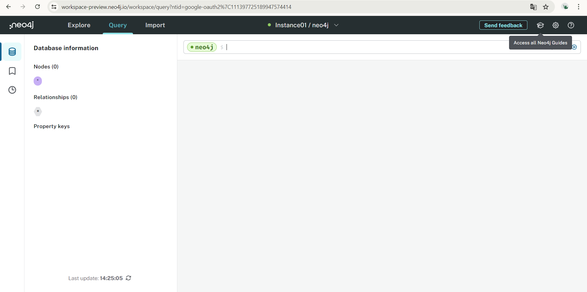
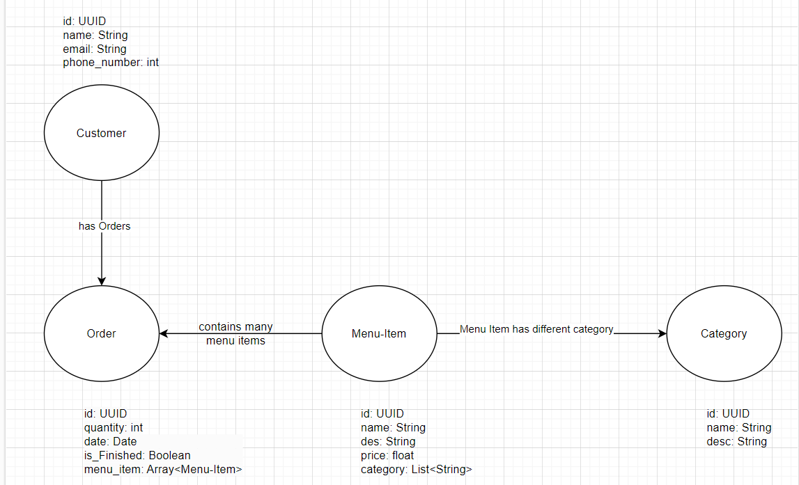

# KN07: Installation und Datenmodellierung für Neo4j

### A: Installation / Account erstellen (30%)

### B: Daten löschen (25%)

[Doku](./res/KN07-Neo4j.drawio)

Bei den Kanten habe ich kurz beschriftet, was die Verbindung zwischen der Knoten sind. Die restliche Attributen habe ich von KN02 übernommen, jedoch habe ich die Order-Liste in der Customer nicht eingesetzt, da es nicht nötig war.
